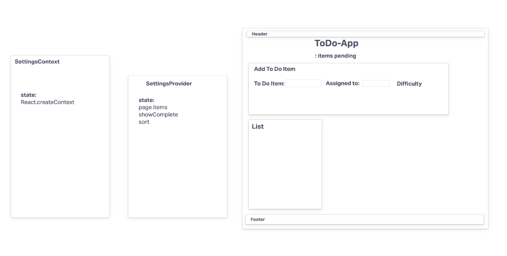

# LAB 31

## Project: ToDo-App

Author: Adrienne Frey

### Problem Domain

Phase 1: Incorporate configuration settings to the application.

### Deployment - Link

[CodeSandbox] ()

### UML

### Collaborators

Joe Davitt 
Jordan Covington